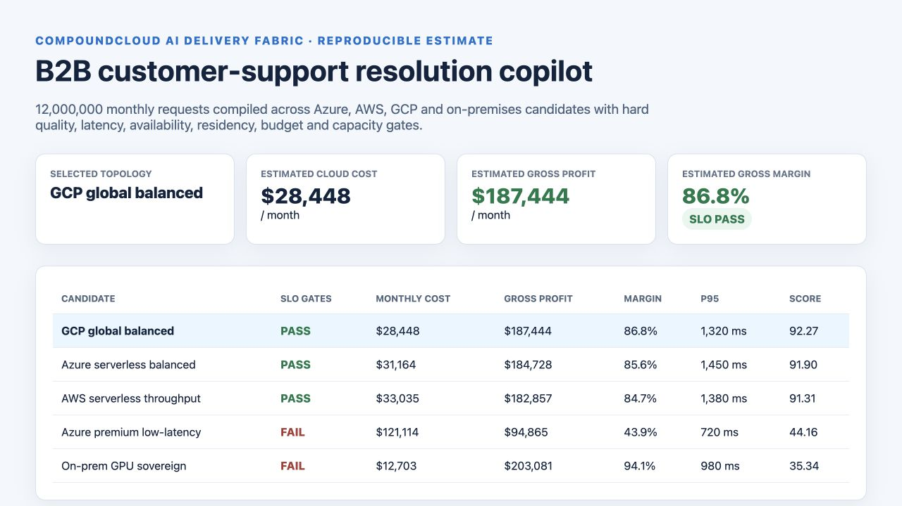
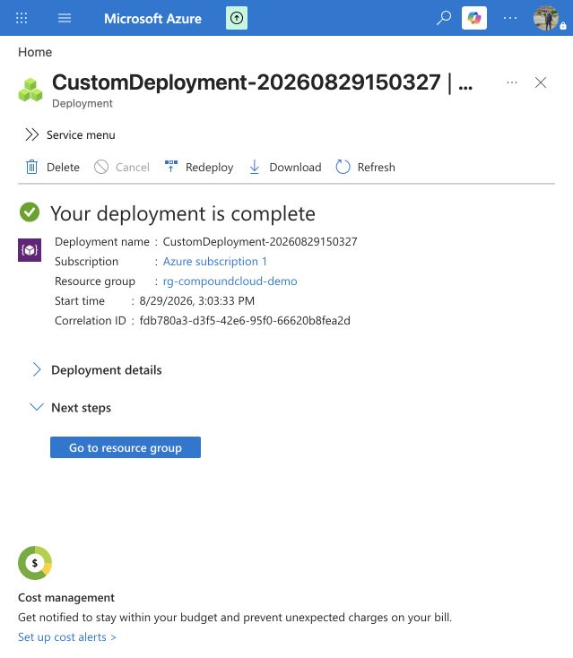

# CompoundCloud AI Delivery Fabric

**Compile AI business demand into a deployable, benchmarked architecture with explicit gross margin, SLO, capacity, and network consequences.**

Most cloud comparison tools ask, “What does this VM or model token cost?” The commercial question is harder: **Which topology delivers the required business outcome at the best risk-adjusted gross margin—and what evidence justifies deploying it?**

CompoundCloud turns a versioned workload contract into ranked Azure, AWS, GCP, and on-premises candidates. It refuses candidates that miss quality, latency, availability, residency, budget, or capacity gates; calculates full per-request economics; and emits a machine-readable decision, an executive report, and an IaC decision contract.

> This repository is an executable first vertical slice. Reference prices and benchmark profiles are transparent assumptions, not fabricated live measurements or provider quotes.



## Verified Azure deployment

The repository's evidence plane was deployed successfully to Azure on 2026-08-29. The
deployment created Application Insights, Log Analytics, a hardened Storage account, and
a private architecture-decision container in `rg-compoundcloud-demo`.



See the complete [deployment and decision evidence](evidence/README.md), including the
resource inventory, deployment correlation ID, and explicit evidence boundaries.

## Try it

```bash
PYTHONPATH=src python3 -m compoundcloud.cli \
  examples/customer-support-saas.json \
  --output generated/customer-support
```

The core has no runtime dependencies. For an installed `compoundcloud` command, run
`python -m pip install -e .` in a Python environment with setuptools available.

Outputs:

- `decision.json`: auditable inputs, ranked candidates, violations, cost breakdown, and selected design;
- `decision.md`: decision memo for engineering and commercial review;
- `main.tf`: a Terraform-readable architecture decision contract for downstream modules.

Run the second workload to see a high-quality regulated scenario change the winner:

```bash
PYTHONPATH=src python3 -m compoundcloud.cli examples/regional-document-factory.json --output generated/document-factory
PYTHONPATH=src python3 -m unittest discover -s tests -v
```

## What is working today

- typed workload specification with validation;
- comparable Azure, AWS, GCP, and on-prem architecture catalog;
- inference, platform, retrieval, and network cost decomposition;
- revenue, gross profit, gross margin, contribution, and break-even calculations;
- peak RPS and capacity-headroom modeling;
- hard SLO, residency, capacity, and budget gates;
- deterministic ranking with every violation exposed;
- generated JSON, Markdown, and Terraform decision artifacts;
- tests for accounting reconciliation and architectural gates;
- examples for AI SaaS and regulated document processing.

## The production system this grows into

| Engine | What it optimizes | Commercial outcome |
|---|---|---|
| Workload compiler | traffic, tokens, quality, latency, residency | requirements become deployable options |
| Model/inference optimizer | routing, batching, caching, quantization | lower cost per successful outcome |
| Retrieval optimizer | chunking, embedding, reranking, graph/vector topology | higher answer quality and conversion |
| Network optimizer | private paths, regions, zones, egress, DNS, hybrid routing | lower latency, failure risk, and transfer cost |
| Capacity simulator | burst, queueing, autoscaling, GPU utilization | revenue survives peaks without chronic overprovisioning |
| Unit economics engine | outcome revenue, cloud cost, labor, migration | architecture tied to gross margin and payback |
| Deployment factory | Terraform, Bicep, Helm, GitOps | repeatable customer environment vending |
| Evidence compiler | deployed configuration and runtime signals | compliance is derived from reality |

See [the architecture](docs/architecture.md) and [unit-economics contract](docs/unit-economics.md).

## Why customers buy

The urgent problem is not “lack of AI governance.” Teams can demo an agent in days, then lose months discovering that quality collapses under representative traffic, private networking changes latency, cross-region transfer destroys margin, capacity cannot meet launch demand, or the cheapest model produces too few successful outcomes.

This fabric makes those tradeoffs testable before the company scales the wrong topology. It also provides a continuous loop after launch: production traces update benchmark profiles; pricing and traffic changes trigger recompilation; alternatives are replayed in ephemeral environments; promotion requires measured evidence.

## Initial ICPs and offers

1. **AI SaaS vendors approaching production scale** — architecture and margin baseline: **$10k–$25k**.
2. **Enterprises moving AI prototypes into regulated production** — workload factory implementation: **$40k–$150k**.
3. **MSPs and consultancies needing a repeatable multi-cloud AI delivery method** — enablement and private distribution: **$75k–$250k**.
4. **High-volume inference platforms** — continuous cost/capacity optimization: **$8k–$30k/month plus 10–20% of independently verified savings**.

Cloud consumption, licenses, taxes, and 24×7 operations are separately scoped. Savings-share contracts require an agreed baseline and exclude volume or quality reductions disguised as optimization.

## OSS distribution and compounding leverage

The Apache-2.0 core includes the schema, compiler, reference adapters, benchmark contract, decision format, IaC interfaces, and examples. Every integration can add a provider, topology, workload, or benchmark profile. That makes the useful artifact a shared corpus of reproducible architecture outcomes—not another closed dashboard.

Commercial layers can provide live contracted-price feeds, hosted benchmarks, GPU-capacity intelligence, environment vending, private adapters, managed optimization loops, verified-savings accounting, and enterprise support. Aggregate benchmark learning must be opt-in and stripped of customer-identifying data.

## Credibility rules

- Estimates, simulated tests, and live measurements are labeled separately.
- No architecture is described as production-ready until its hard gates pass.
- Provider pricing is versioned with effective dates and regions.
- Quality is measured on customer-representative evaluation sets.
- Every optimization protects the business outcome; degraded quality is not a saving.
- Security and compliance evidence comes from deployed state and runtime telemetry.

## Roadmap

- provider pricing adapters with dated snapshots and customer discount inputs;
- executable Terraform/Bicep/Helm topology modules;
- OpenTelemetry trace ingestion and workload-shape discovery;
- Locust/k6 traffic replay plus latency and failure benchmark receipts;
- queueing and autoscaling simulation for CPU/GPU/serverless profiles;
- Azure/AWS/GCP private-network path and egress modeling;
- multi-model routing, semantic caching, fallback, and quality evaluation;
- signed promotion receipts and drift-triggered recompilation;
- IaC-to-control mappings for customers that need audit evidence.

## Work with A2Z SOC

If a production AI workload needs lower latency, higher reliability, clearer unit economics, or a repeatable multi-cloud deployment factory, request an architecture benchmark at **[a2zsoc.com](https://a2zsoc.com)**.
