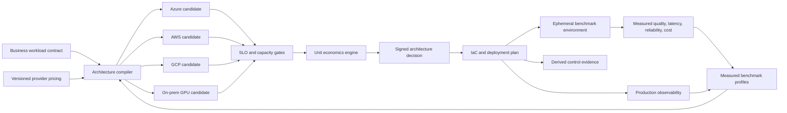

# Architecture

## Control loop

The compiler does not claim that a spreadsheet estimate proves production fitness. It produces a versioned hypothesis. An ephemeral environment tests representative traffic; measured results update benchmark profiles; the compiler re-ranks candidates; a promotion decision records the exact inputs and evidence.

## Networking is a first-class decision variable

Each candidate describes a topology rather than treating networking as plumbing. The production implementation will model private endpoints, ingress and egress paths, DNS, cross-zone traffic, hybrid routing, service-to-service encryption, failure domains, and the latency/cost consequences of each choice.

## IaC to compliance-as-code

Infrastructure is the source of truth. Policy checks and evidence are generated from the compiled topology and deployed state. They cannot silently substitute for performance, reliability, or business outcomes.

