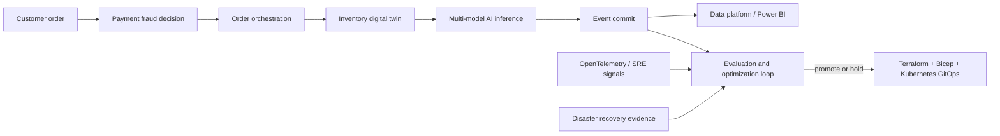

# Enterprise AI Production Lab

This release turns CompoundCloud from a point-in-time architecture calculator into the testable integration boundary for an **Enterprise AI Platform**. It connects business transactions, **AI agents**, **cloud architecture**, **Kubernetes**, **DevOps**, **SRE**, **FinOps**, **cybersecurity**, and **data engineering** through one promotion contract.

## Revenue transaction

Each transaction carries a stable ID, revenue, risk signal, inventory decision and token demand. The replay suppresses duplicates, rejects fraud and unavailable inventory, injects transient failures, calculates contribution profit and evaluates RTO/RPO. `compoundcloud.loop.evaluate_promotion` then blocks a candidate that regresses successful outcomes, contribution profit, recovery or cost tolerance.

## Claim boundary

The checked-in result is a deterministic local integration test. It proves contract behavior and arithmetic; it does **not** prove Azure network latency, AKS capacity, model quality, or production availability. The Kubernetes manifest is a hardened deployment contract for the future HTTP service; the present CLI does not implement `serve`. Those claims require a container image, deployed adapters, representative data, cloud load tests and signed telemetry receipts.

## Search and role alignment

Broad discovery terms are used where the implementation supports them: Artificial Intelligence, Generative AI, Machine Learning, Microsoft Azure, Cloud Computing, Kubernetes, DevOps, Cybersecurity, Data Engineering, Data Science, Business Intelligence, Power BI and Digital Transformation. Practitioner terms describe the actual engineering surface: Enterprise AI Platform, Platform Engineering, Solution Architecture, Distributed Systems, AKS, Kafka, MLOps, LLMOps, AI Agents, OpenTelemetry, Site Reliability Engineering, Disaster Recovery, FinOps, Terraform, Bicep and GitOps.

No claim is made that this repository has measured keyword search volumes. Validate wording against the target market, geography and date using a search-console or advertising dataset before paid distribution.

## Production exit criteria

- adapters call PaymentShield, FlowForge, SupplyTwin, an inference gateway and a durable event store;
- OpenTelemetry traces join every stage by transaction ID;
- representative load tests report p50/p95/p99, throughput, error rate and saturation;
- failure drills test zone, region, dependency and credential rotation paths;
- quality evaluations use customer-approved datasets and graders;
- GitOps deploys immutable images with provenance, SBOM and rollback receipts;
- unit economics reconcile metered cloud, model, data-transfer and support costs;
- security review covers identity, secrets, network boundaries, data lifecycle and tenant isolation.
