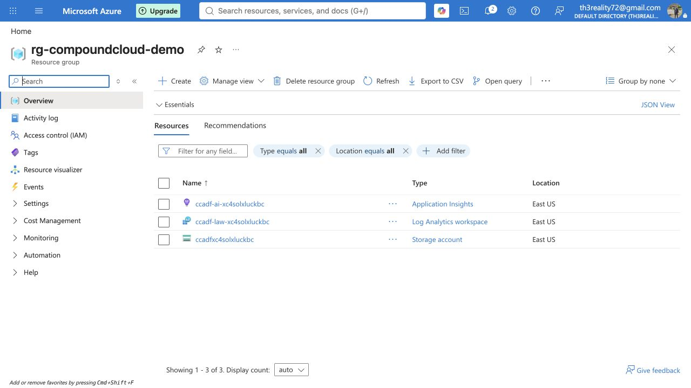

# Deployment and decision evidence

Evidence captured on **2026-08-29** from the authenticated Azure portal and the deterministic CompoundCloud compiler.

## Azure deployment

- Subscription: `Azure subscription 1`
- Resource group: `rg-compoundcloud-demo`
- Region: `East US`
- Deployment: `CustomDeployment-20260829150327`
- Result: `Your deployment is complete`
- Start time: `2026-08-29 15:03:33 EEST`
- Correlation ID: `fdb780a3-d3f5-42e6-95f0-66620b8fea2d`
- Template: [`infra/azure/main.json`](../infra/azure/main.json)

The deployed evidence plane contains:

- Application Insights `ccadf-ai-xc4solxluckbc`;
- Log Analytics workspace `ccadf-law-xc4solxluckbc`;
- Storage account `ccadfxc4solxluckbc`;
- private blob container `architecture-decisions`.

## Unit-economics evidence

The screenshot below renders the exact values stored in
[`generated/customer-support/decision.json`](../generated/customer-support/decision.json).
It is labeled as a reproducible estimate because catalog assumptions are not a substitute
for provider quotes or production measurements.

## What this evidence proves—and does not prove

It proves that the published infrastructure template deployed successfully, the expected
Azure evidence resources exist, and the compiler deterministically produces auditable
rankings and economics. It does **not** claim that the reference costs are contracted
prices, that simulated latency is production telemetry, or that the entire multi-cloud
roadmap is already deployed.

